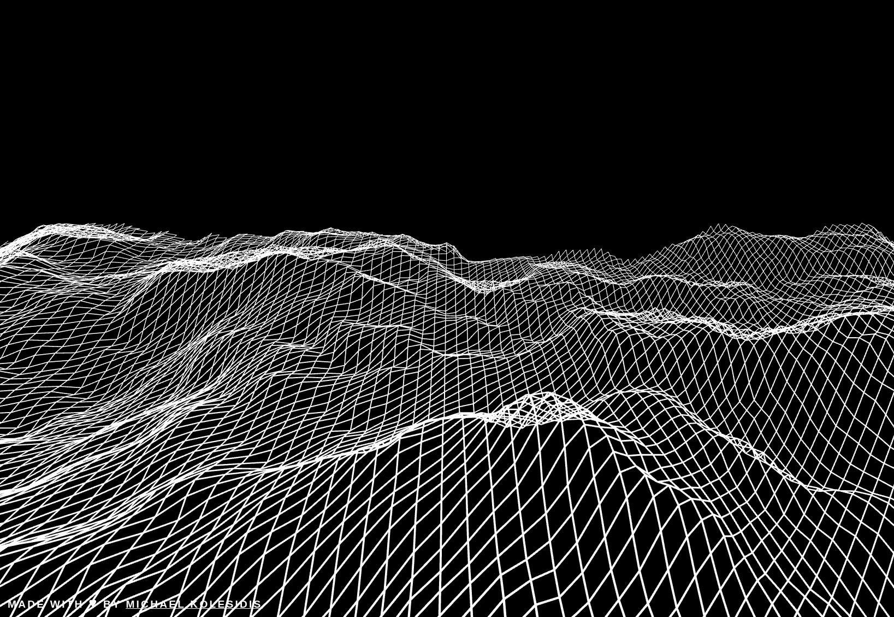

  
  <h1>Perlin Landscape</h1>
  
  <h3>Landscape created dynamically using Perlin noise.</h3>

  <a href="https://perlin-landscape.netlify.app/"><h3>Try me!</h3></a>

  

  
  

## Technologies Used

&nbsp;&nbsp;&nbsp;&nbsp;&nbsp;&nbsp;

&nbsp;&nbsp;&nbsp;&nbsp;&nbsp;&nbsp;

&nbsp;&nbsp;&nbsp;&nbsp;&nbsp;&nbsp;

&nbsp;&nbsp;&nbsp;&nbsp;&nbsp;&nbsp;

## Description

A 3D landscape is created dynamically using the Perlin noise function of p5.js and <a href="https://github.com/spite/ccapture.js/">CCapture.js</a>.

## Screenshots

## License

Copyright (c) 2022 Michael Kolesidis 
Licensed under the [MIT License](https://github.com/michaelkolesidis/perlin-landscape/blob/main/LICENSE).

 
 

[//]: # (Free Software)

   
   

  

                                                       

  

